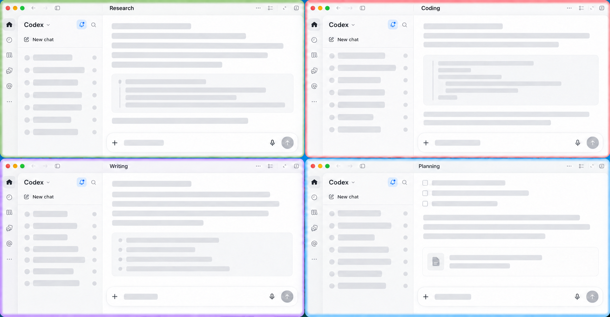
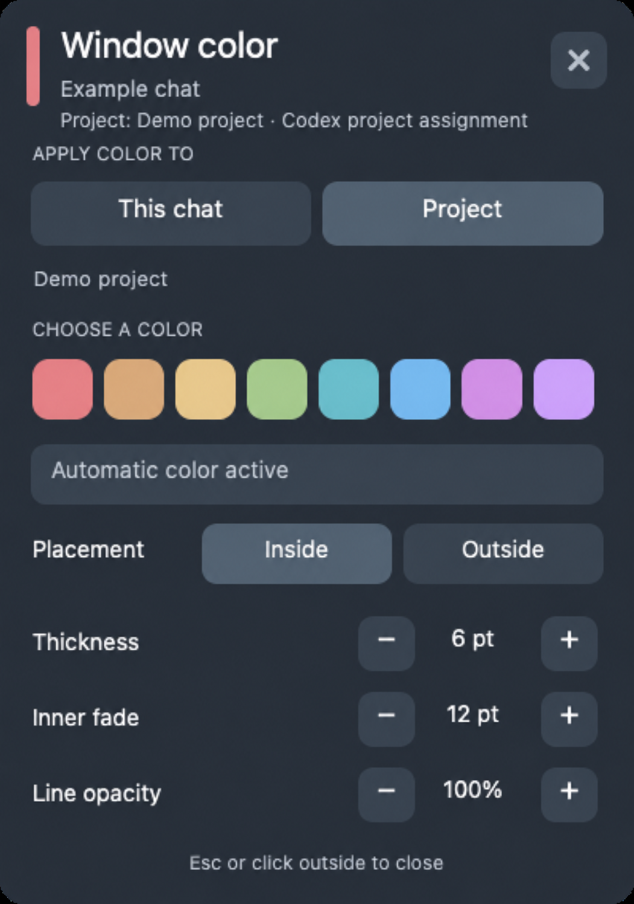

# ColorQ

**See which Codex window you are in at a glance.** ColorQ gives each macOS Codex Desktop window a stable color based on its active chat or project. It is designed for people who keep many tasks open and want a quick visual cue when switching contexts.



*Privacy-edited illustration based on the desktop UI. Conversation content is replaced with placeholders.*

ColorQ currently supports **macOS only**. It runs outside the Codex app through [Hammerspoon](https://www.hammerspoon.org/), so it does not modify, inject into, or require changes to ChatGPT/Codex Desktop. The default indicator is a colored line along the **inside top and left edges** of each window, with an optional inward fade. [JankyBorders](https://github.com/FelixKratz/JankyBorders) is optional for an outside-border mode.

## Install

1. Install [Hammerspoon](https://www.hammerspoon.org/go/) and Python 3 with `sqlite3`. On a Mac with Homebrew, you can use:

   ```sh
   brew install --cask hammerspoon
   brew install python
   ```

2. Clone ColorQ and run the installer:

   ```sh
   git clone https://github.com/HarveyLijh/ColorQ.git
   cd ColorQ
   ./install.sh
   ```

3. Open Hammerspoon, allow the macOS **Accessibility** permission, and choose **Reload Config** from its menu. Hammerspoon requires that permission to inspect windows and handle the palette shortcut. No ChatGPT/Codex setting needs to be changed. [Hammerspoon's setup guide](https://www.hammerspoon.org/go/) covers the permission step.

The installer places the module in `~/.hammerspoon/colorq/` and adds one `require("colorq").start()` line to `~/.hammerspoon/init.lua`. It backs up an existing `init.lua` before changing it and preserves existing color settings. If it finds the standard older ChatGPT window-color module, it copies that module's settings and replaces its startup line. Custom legacy startup code needs to be disabled manually to avoid duplicate overlays.

## Use

- Move the pointer to the middle of a Codex window's title bar and click the small color icon. The palette opens for that window. **Esc**, the **×** button, a click outside, or a second click on the icon closes it.
- Choose **This chat** to color the active chat or **Project** to color all chats in its Codex project. Then click a swatch. A chat color takes priority over a project color; otherwise ColorQ chooses a stable color automatically.
- Adjust **Thickness**, **Inner fade**, and **Line opacity** in the palette. Changes preview and save immediately.
- Use **⌥⌘C** for the chat palette, **⌥⌘P** for the project palette, or **⌥⌘0** to clear the current chat override. The Hammerspoon menu-bar **🎨** menu has the same actions and a link to the configuration file.



*Privacy-edited palette screenshot; chat and project names are examples.*

ColorQ reads the active chat title from macOS Accessibility and looks up its Codex project in local Codex metadata. This lookup is read-only and runs in the background. If two projects contain chats with the same title, ColorQ leaves the project unresolved instead of guessing. Chat-title rules are shared by chats with the same title. If a new chat has no readable title yet, you can assign a temporary window label from the menu.

## Configuration

Edit `~/.hammerspoon/colorq/config.json`, then choose **Reload config.json** from the **🎨** menu. The installer starts from [`config.example.json`](config.example.json). Key fields:

| Field | Purpose |
| --- | --- |
| `renderer` | `inside` (default), `borders` with optional JankyBorders, or `canvas` for a top strip |
| `thickness` | Solid line width, 1–12 pt |
| `fadeWidth` | Inward fade width, 0–32 pt |
| `lineOpacity` | Solid line and fade-start opacity, 0–100% |
| `palette` | Automatic colors and the palette's visible swatches |
| `chatRules` | Exact chat title → color, such as `"Example chat": "#61AFEF"` |
| `projectRules` | Exact Codex project name → color |
| `chatProjects` | Optional manual project fallback when no actual assignment is found |

Colors accept `#RRGGBB` or `#RGB`. The palette currently shows the first eight valid colors in `palette`. For outside borders, install [JankyBorders](https://github.com/FelixKratz/JankyBorders), then select **Outside** in ColorQ's palette. The default inside mode does not need JankyBorders.

## Scope and privacy

ColorQ reads the target window's Accessibility title and local Codex files under `~/.codex/` to identify its project. It does not read message bodies for color rules, send chat data to a server, or change the Codex app. The local metadata format and Accessibility tree can change with future Codex releases; if project identification becomes unavailable, chat-title coloring remains usable.

To stop ColorQ, remove or comment out `require("colorq").start()` in `~/.hammerspoon/init.lua` and reload Hammerspoon. Your color settings remain in `~/.hammerspoon/colorq/config.json` until you remove them.
